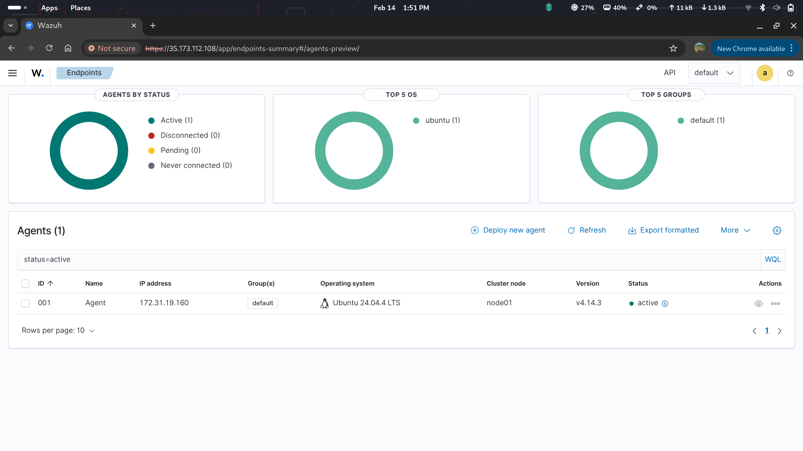

# 🔐 SIEM Security Monitoring with Wazuh + Machine Learning

## 📌 Overview

This project implements a **Security Information and Event Management (SIEM)** system using **Wazuh**, enhanced with **Machine Learning (Random Forest)** to detect anomalies in web server logs.

The system is designed to improve traditional rule-based detection by adding an intelligent layer for anomaly classification.

---

## 🚀 Key Features

* Real-time log monitoring using Wazuh
* Centralized log storage with Elasticsearch
* Visualization using Kibana
* Machine Learning-based anomaly detection (Random Forest)
* Automated alert notification via Telegram
* Detection of attacks:

  * SSH brute force
  * Port scanning (Nmap)
  * File integrity changes

---

## 🏗️ System Architecture


---

## 🔄 Workflow


---

## 📊 Machine Learning

* Algorithm: Random Forest
* Features used:

  * firedtimes
  * rule_level
  * hour
  * is_night
  * is_ssh
  * log_length

---

## 📸 System Output

### Wazuh Alert



### Kibana Monitoring


### Telegram Alert


### Confusion Matrix


---

## 🛠️ Technologies Used

* Wazuh
* Elasticsearch
* Kibana
* AWS EC2
* Python (Scikit-learn, Pandas)
* Telegram Bot API

---

## 📂 Project Structure

```bash
scripts/        # Machine learning & log processing
docs/           # System diagrams
screenshots/    # Output visualization
config/         # Configuration notes
report/         # Final project report
```

---

## 🎯 Result

The integration of machine learning improves anomaly detection and reduces false positives compared to rule-based SIEM alone.

---

## 📎 Full Report

See full documentation here:
`report/laporan_tugas_akhir.pdf`

## 👨‍💻 Author
Muhammad Razif  
Cybersecurity Enthusiast | SOC Analyst (Aspiring)
