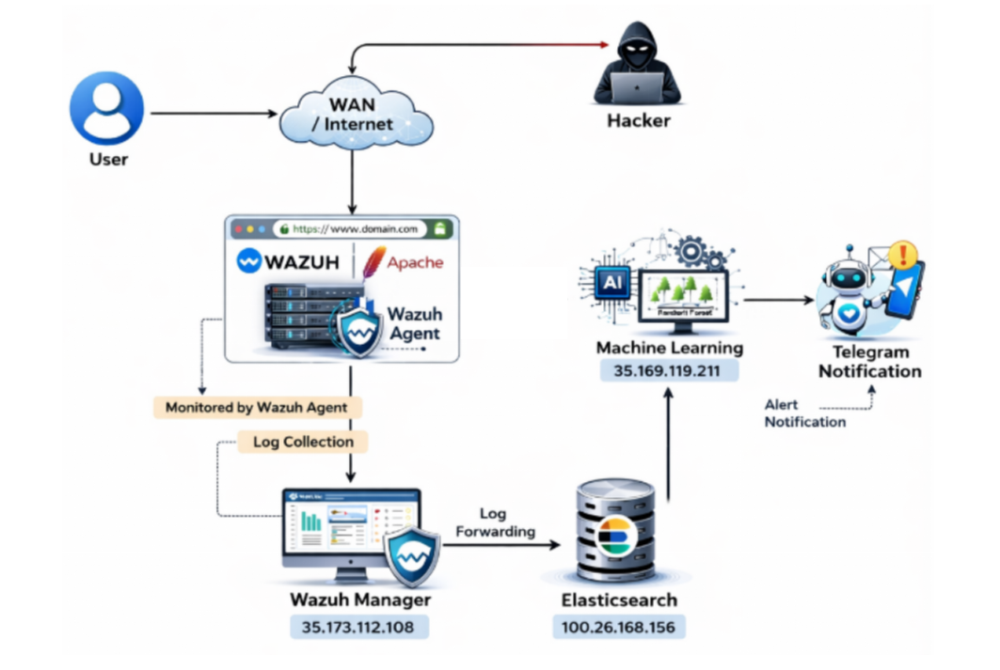
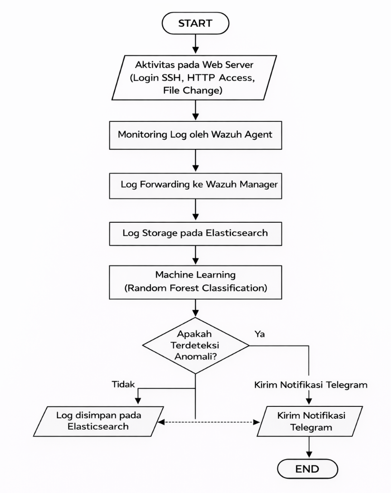
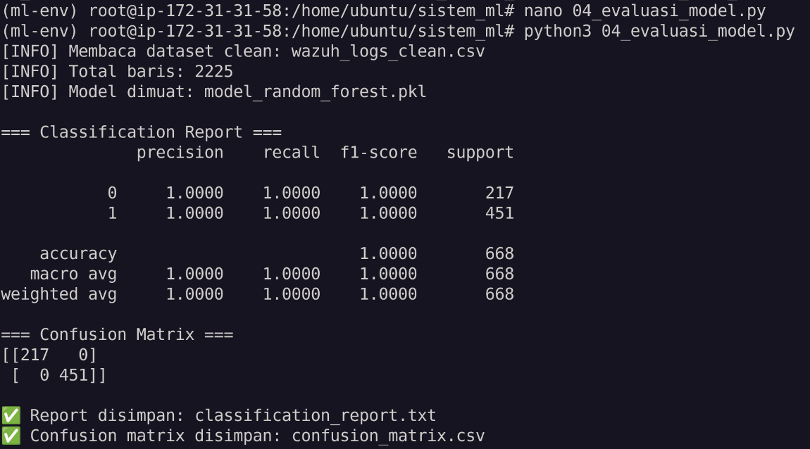
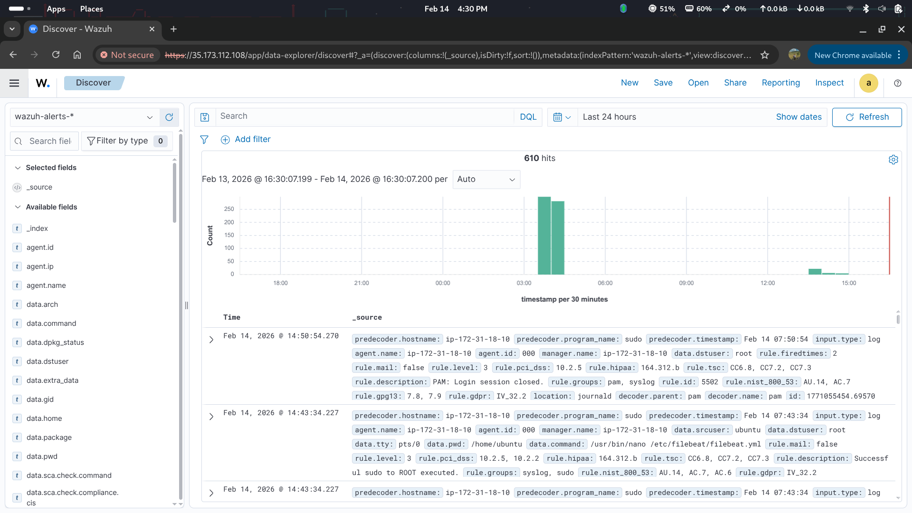
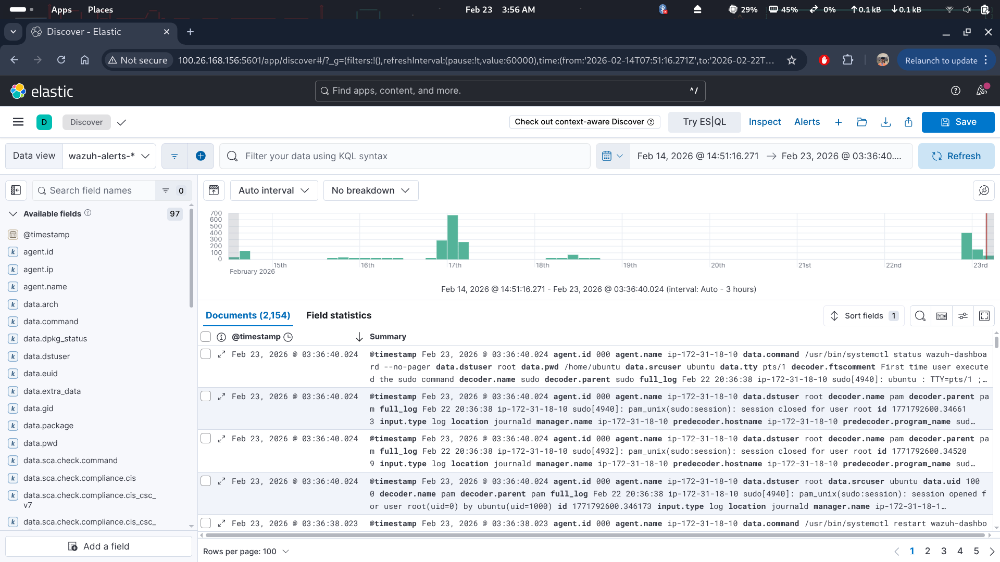
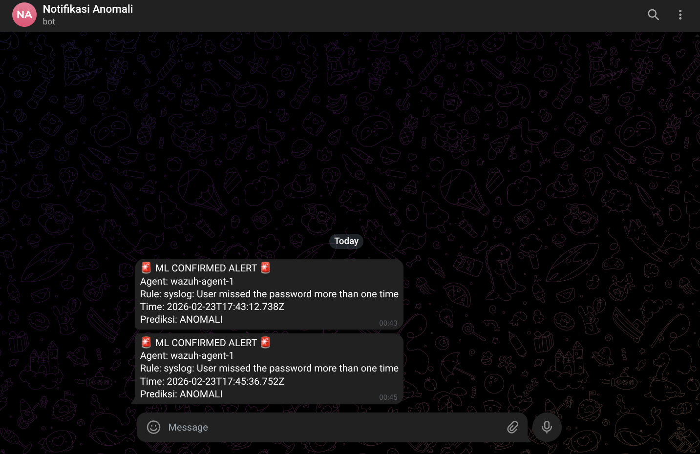

# 🔐 SIEM Security Monitoring with Wazuh + Machine Learning

## 🚨 Problem

Traditional SIEM systems such as Wazuh rely on **rule-based detection**, which has several limitations:

* Unable to detect unknown or new attack patterns
* High number of false positive alerts
* Requires manual log analysis by administrators

---

## 💡 Solution

This project enhances SIEM capabilities by integrating **Machine Learning (Random Forest)** to:

* Classify logs into **normal vs anomaly**
* Reduce false positives
* Add intelligent anomaly detection on top of rule-based systems

---

## 🏗️ System Architecture



---

## 🔄 Workflow



---

## ⚙️ How the System Works

1. Web server generates logs (SSH, Apache, system logs)
2. Wazuh Agent collects and sends logs to Wazuh Manager
3. Wazuh Manager analyzes logs using rule-based detection
4. Logs are stored in Elasticsearch
5. Machine Learning Engine:

   * Fetches logs from Elasticsearch
   * Performs preprocessing & feature engineering
   * Classifies logs using Random Forest
6. If anomaly is detected → Telegram notification is sent

---

## 🧪 Attack Simulation

The system was tested using several simulated attacks:

* SSH brute force attack (Hydra)
* Port scanning (Nmap)
* File modification attack

These attack logs were used as:

* Training dataset
* Testing dataset
* Real-time detection scenarios

---

## 🧠 Machine Learning Details

### Algorithm

* Random Forest (Supervised Learning)

### Features Used

* firedtimes (alert frequency)
* rule_level (severity level)
* hour (time of event)
* is_night (00:00–05:00 indicator)
* is_ssh (SSH activity indicator)
* log_length (log message length)

---

## 📊 Results

### Confusion Matrix



### Key Metrics

* Accuracy: 1.000
* Precision: 1.000
* Recall: 1.000
* F1-Score: 1.000

### ⚠️ Note on Model Performance

The model achieved perfect scores (Accuracy, Precision, Recall, F1-Score = 1.000).

This is mainly due to:
- Dataset generated from controlled attack simulations (Hydra, Nmap)
- Clear separation between normal and attack patterns
- Strong feature representation (rule_level, firedtimes, etc.)

While the results indicate high model performance, they may not fully represent real-world scenarios where:
- Data is more noisy and complex
- Attack patterns are less obvious
- Class boundaries are not clearly separable

### 📌 Interpretation

The perfect score suggests that the model has learned the patterns very well within the given dataset.

However, further validation with real-world data is required to ensure:
- Model generalization
- Robust anomaly detection capability
  
### Key Insights

* Machine learning improves anomaly detection accuracy
* Reduces false positive alerts from rule-based system
* Adds intelligent validation layer for security events

---

## 📸 System Output

### 🔹 Wazuh Alerts



### 🔹 Kibana Monitoring



### 🔹 Telegram Notification



---

## ⚙️ Machine Learning Pipeline Scripts

* `data_collection.py` → Fetch logs from Elasticsearch
* `preprocessing.py` → Clean & transform log data
* `train_model.py` → Train Random Forest model
* `evaluate.py` → Evaluate model performance
* `detection.py` → Real-time anomaly detection

---

## 🛠️ Tech Stack

* Wazuh (SIEM)
* Elasticsearch
* Kibana
* AWS EC2
* Python (Scikit-learn, Pandas, NumPy)
* Telegram Bot API

---

## 📂 Project Structure

```bash
wazuh-siem-ml-anomaly-detection/
│
├── docs/            # System diagrams (topology & flowchart)
├── screenshots/     # Output visualization
├── scripts/         # Machine learning pipeline
├── dataset/         # Sample logs (optional)
├── model/           # Trained model
├── config/          # System & ML configuration
├── report/          # Final report (PDF)
└── README.md
```

---

## 🎯 SOC Use Case

This system can be used by a Security Operations Center (SOC) analyst to:

* Monitor real-time security logs
* Detect suspicious activities automatically
* Reduce manual log analysis workload
* Improve incident response time
* Identify anomalies that are not detected by rule-based SIEM

---

## ⚠️ Limitations

* Dataset based on simulated attacks
* No hyperparameter tuning (basic implementation)
* Limited to Random Forest (no deep learning)

---

## 🚀 Future Improvements

* Implement unsupervised anomaly detection
* Apply hyperparameter tuning
* Integrate with real enterprise SOC environment
* Improve dataset diversity

---

## 👨‍💻 Author

Muhammad Razif
Cybersecurity Enthusiast | Aspiring SOC Analyst
